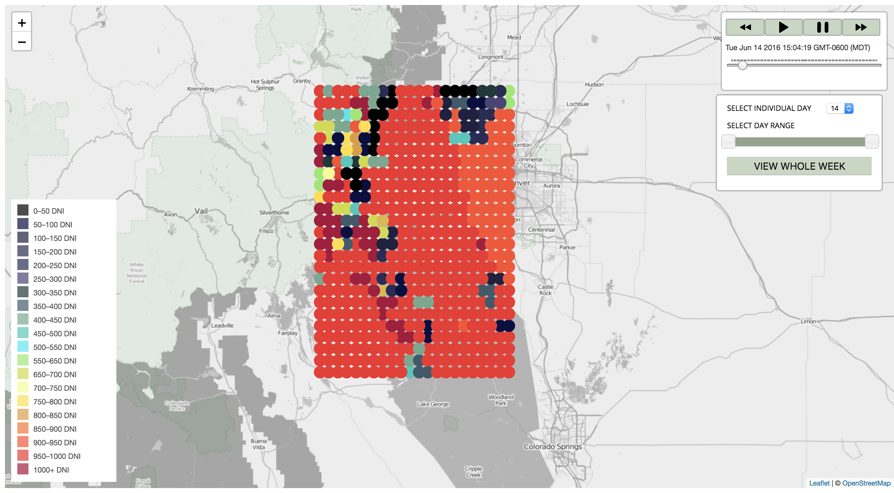

# Denver Solar Radiation Visualization

### Summary
This project is a data visualization of solar radiation in Denver, CO for June 2016. We pulled data in from NREL's National Solar Radiation Database (NSRDB) and used the DNI (Direct Normal Irradiance) data. The map was built with Leaflet.Timeline and backend was built with Express with Knex. This project was built at the request of NREL's NSRDB team, with the hope that the data visualization could be used as a tool for users to interact with the data from the database and gain a understanding on how they could use the information in the database. 

[Example of map visualization](https://denver-solar-visualization.herokuapp.com/)

Contributors: 
[Sabrina Kennedy](github.com/skenne21)
[Maddy Dannenberg](github.com/mmdberg)

### Screenshot Homepage

